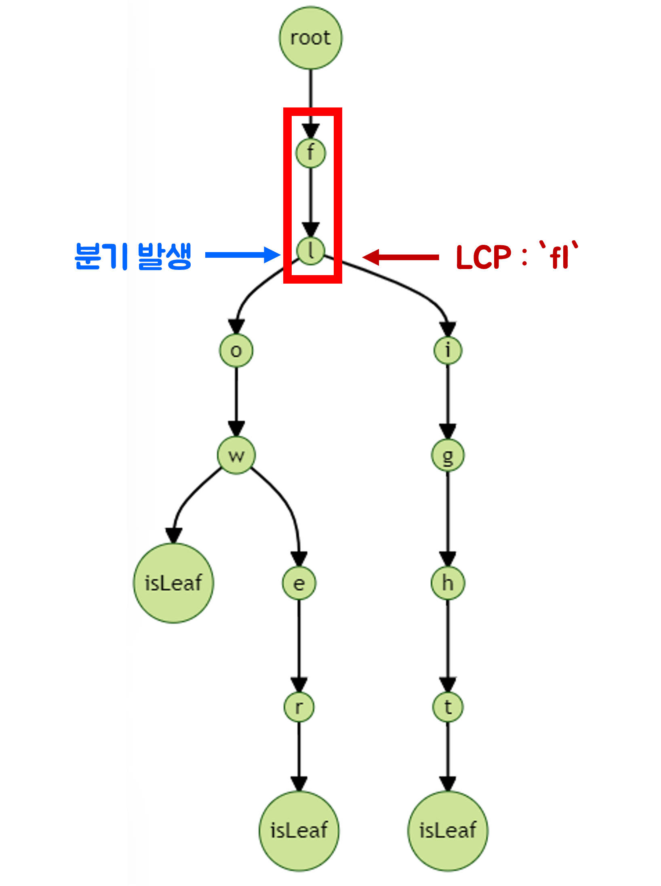

## 목적
- 여러개의 문자열이 있을 때, 가장 긴 접두사를 찾고 싶은 경우

## 시간복잡도
- O(n) (n == length of prefix)

## 흐름
1. Trie Tree를 생성한다.
2. Trie에 모든 문자열을 추가한다.
3. root 노드를 기준으로 자식 노드의 개수가 1개 인 경우에 자식을 탐색한다.
4. 만약, 자식 노드의 개수가 2개 이상이면 탐색을 종료한다.  
   (자식 노드가 2개 이상 시점부터 분기가 발생하여 이후 문자는 공통 접두사가 아니기 때문)

### Ex.
> ["flower","flow","flight"]

위와 같은 문자열 배열이 있다고 가정하면, `fl` 이후에서 분기가 발생하기 때문에 `fl`이 `LCP`가 되는 것이다.



## 코드
```python
class Trie:
    def __init__(self):
        self.head = {}

    def add(self, word:str) -> None:
        curr = self.head
        for ch in word:
            if ch not in curr: curr[ch] = {}
            curr = curr[ch]
        curr['isLeaf'] = True

    def findLCP(self) -> str:
        curr = self.head
        ans = ""

        while True:
            ch = next(iter(curr))
            if ch == "isLeaf" or len(curr) > 1: break
            curr = curr[ch]
            ans += ch

        return ans

```

## 연습문제
- https://leetcode.com/problems/longest-common-prefix/

